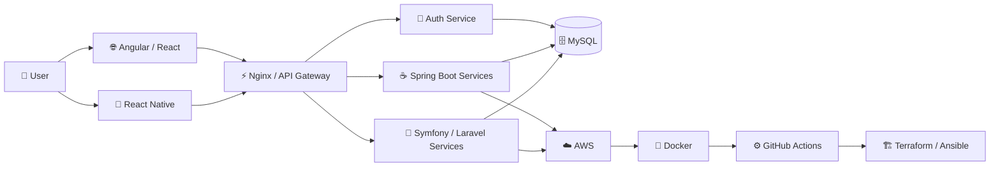

<!-- =========================================================
     MOHAMMED AMINE ELAAZZOUZI — GITHUB PROFILE
     github.com/bevvee
========================================================= -->

<div align="center">


</div>

<div align="center">


</div>

<br/>

<div align="center">

[](https://linkedin.com/in/medelaazzouzi)
[](https://github.com/bevvee)
[](https://github.com/bevvee)

</div>

<br/>

---

# `> whoami`

```bash
┌──(bevvee㉿github)-[~]
└─$ whoami

Name        : Mohammed Amine Elaazzouzi
Role        : Software Engineering Student
Focus       : Full-Stack Web & Mobile Development
Location    : Morocco 🇲🇦

Backend     : Java / Spring Boot / PHP / Symfony / Laravel
Frontend    : Angular / React / TypeScript
Mobile      : React Native
Architecture: Microservices / REST APIs / JWT
DevOps      : Docker / AWS / Terraform / Ansible / CI/CD
Databases   : MySQL

Status      : Building. Learning. Shipping.
```

---

<div align="center">

## ⚡ What I Do

</div>

<table>
<tr>
<td width="50%" valign="top">

### 🧠 Backend Engineering

```text
Java
├── Spring Boot
├── REST APIs
├── JWT Security
├── JUnit
└── Microservices

PHP
├── Symfony
├── Laravel
├── PHPUnit
├── PHPStan
├── PHP CS Fixer
└── PHP CodeSniffer
```

</td>

<td width="50%" valign="top">

### 🎨 Frontend & Mobile

```text
Web
├── Angular
├── React
├── TypeScript
├── JavaScript
└── Tailwind CSS

Mobile
├── React Native
├── Expo
├── Redux
├── Jest
└── ESLint
```

</td>
</tr>

<tr>
<td width="50%" valign="top">

### ☁️ DevOps & Cloud

```text
Infrastructure
├── Docker
├── Linux
├── Nginx
├── AWS
├── Terraform
└── Ansible

Delivery
├── GitHub Actions
├── CI/CD
├── Git
└── GitHub
```

</td>

<td width="50%" valign="top">

### 🏗️ Software Architecture

```text
Architecture
├── Microservices
├── REST APIs
├── MVC
├── Repository Pattern
├── Service Pattern
├── Dependency Injection
└── Role-Based Security
```

</td>
</tr>
</table>

---

<div align="center">

# 🧬 My Technology DNA

### Languages


### Backend


### Frontend & Mobile


### Databases


### DevOps / Cloud / Tools


</div>

---

<div align="center">

# 🏗️ I Like Building Systems Like This

</div>



---

<div align="center">

# 🚀 Featured Engineering Project

</div>

<table>
<tr>
<td>

## 🏥 ShifaTech

**AI-powered Medical Management Platform**

A distributed healthcare platform designed around multiple services, role-based security, APIs, cloud deployment and AI-assisted medical image processing.

### Engineering stack

`Spring Boot` · `Symfony` · `Angular` · `Python` · `FastAPI`

`MySQL` · `Docker` · `AWS` · `Terraform` · `Ansible`

`GitHub Actions` · `REST APIs` · `Microservices` · `JWT`

### What I worked on

- 👥 Led a team of **5 developers**
- 🔐 Developed authentication with **Spring Boot**
- ⚙️ Built business services using **Symfony**
- 🔗 Designed and integrated **REST APIs**
- 🧠 Integrated an AI service using **FastAPI / Python**
- 🖥️ Developed frontend features with **Angular**
- 🐳 Containerized services using **Docker**
- ☁️ Worked on deployment using **AWS**
- 🏗️ Infrastructure automation using **Terraform & Ansible**
- 🔄 Implemented CI/CD using **GitHub Actions**

</td>
</tr>
</table>

---

<div align="center">

# 📡 Current Transmission


</div>

---

<div align="center">

# 📊 GitHub Intelligence


<br/><br/>


</div>

---

<div align="center">

# 🧠 Most Used Languages


</div>

> GitHub language statistics only reflect public repository code and do not represent my complete technical experience.

---

<div align="center">

# ⏱️ Coding Activity


<br/><br/>


</div>

---

<div align="center">

# 🐍 Watch My Contributions Get Eaten

<picture>
  <source media="(prefers-color-scheme: dark)" srcset="https://raw.githubusercontent.com/bevvee/bevvee/output/github-contribution-grid-snake-dark.svg">
  <source media="(prefers-color-scheme: light)" srcset="https://raw.githubusercontent.com/bevvee/bevvee/output/github-contribution-grid-snake.svg">
  
</picture>

</div>

---

<div align="center">

# 🧩 Developer Philosophy

</div>

```java
public class Developer {

    private final String name = "Mohammed Amine Elaazzouzi";

    private final String[] mindset = {
        "Understand the problem",
        "Design before coding",
        "Write maintainable code",
        "Test what matters",
        "Automate repetitive work",
        "Keep learning",
        "Ship."
    };

    public void build() {

        while (true) {

            learn();
            design();
            code();
            test();
            refactor();
            deploy();

        }
    }
}
```

---

<div align="center">

# 🎯 Currently Focused On

</div>

```text
01. Advanced Java & Spring Boot
02. Microservices Architecture
03. Clean Architecture & Design Patterns
04. REST API Design & Security
05. Docker & Containerized Environments
06. AWS Cloud Infrastructure
07. CI/CD Automation
08. Terraform & Infrastructure as Code
09. React Native Mobile Development
10. Writing cleaner, maintainable software
```

---

<div align="center">

# 🤝 Let's Build Something

I'm interested in working on challenging projects involving

**Backend Engineering · Full-Stack Development · Mobile Apps · Cloud · DevOps**

<br/>

[](https://linkedin.com/in/medelaazzouzi)

[](https://github.com/bevvee)

<br/>

### `while(alive) { learn(); build(); improve(); }`

<br/>


</div>
